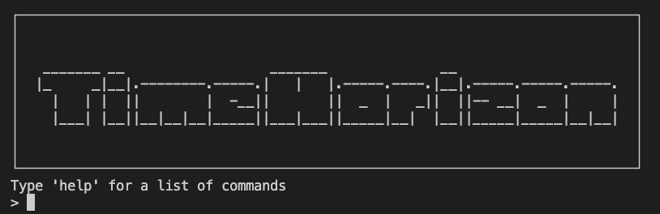
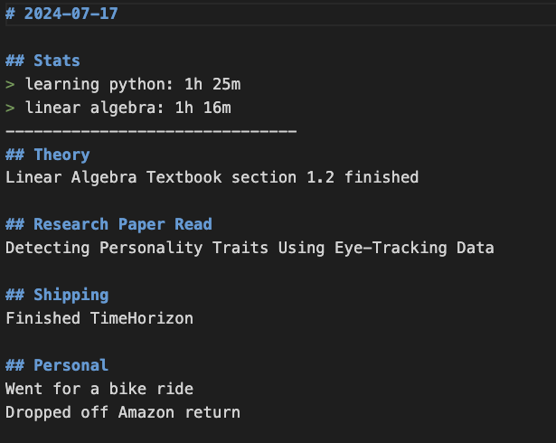

# TimeHorizon
A Python CLI that tracks how much time you're putting into a given subject. Provides a simple way to track your time, and to export your data to applications such as Excel to analyze your time spent. 

A CLI may discourage the use of the application, but I just wanted to make a time tracking app quickly and easily. 

# Installation Instructions
Clone the repo, install the libraries needed

# How to use
Refer to the `help` command for familiarizing with the commands.

cd into TimeHorizon's directory using your terminal and run timehorizon.py.

## Data
Your data is stored locally, in ./journal and ./csv 

Don't worry about the today.txt, which will be created after your first timer session. This file is to store the current days timer sessions, allowing you to freely exit the program. Also, if your timer data is wrong, you are able to freely change it in today.txt. The subject is before the comma and the time in seconds is after. 

### ./journal 
This is where the markdown files are stored for every day `endday` was used. 

### ./csv
This is where the data is sent to a .csv file for the analyticals. 

## Workflow
When you want to track a project/subjects time, type `start subject` into the CLI.

Then, when your session is finished, you will see how much time was spent. 

Repeat as many times as you wish.

At the end of the day, type in `endday` into the CLI. This will add all the times spent on each subject, and ask you to write down the things you've accomplished throughout the day (which you should post on Twitter!). You are able to write anything you want in this section, but here's my format for inspiration:

